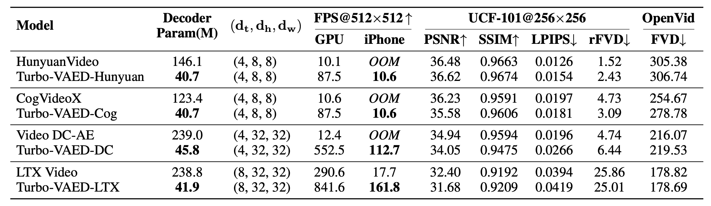
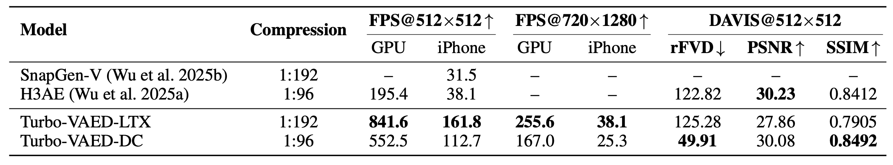

<h1> Turbo-VAED </h1>
<h2>Fast and Stable Transfer of Video-VAEs to Mobile Devices</h2>

Ya Zou\*, [Jingfeng Yao](https://github.com/JingfengYao)\*, Siyuan Yu, [Shuai Zhang](https://github.com/Shuaizhang7), [Wenyu Liu](http://eic.hust.edu.cn/professor/liuwenyu), [Xinggang Wang](https://xwcv.github.io/index.htm)📧

Huazhong University of Science and Technology (HUST) 

(\* equal contribution, 📧 corresponding author: xgwang@hust.edu.cn)

## 📄 Introduction

There is a growing demand for deploying large generative AI models on mobile devices. For recent popular video generative models, however, the Variational AutoEncoder (VAE) represents one of the major computational bottlenecks. Both large parameter sizes and mismatched kernels cause out-of-memory errors or extremely slow inference on mobile devices. To address this, we propose a low-cost solution that efficiently transfers widely used video VAEs to mobile devices. 

(1) We analyze redundancy in existing VAE architectures and get empirical design insights. By integrating 3D depthwise separable convolutions into our model, we significantly reduce the number of parameters. 

(2) We observe that the upsampling techniques in mainstream video VAEs are poorly suited to mobile hardware and form the main bottleneck. In response, we propose a decoupled 3D pixel shuffle scheme that slashes end-to-end delay. Building upon these, we develop a universal mobile-oriented VAE decoder, **Turbo-VAED**. 

(3) We propose an efficient VAE decoder training method. Since only the decoder is used during deployment, we distill it to Turbo-VAED instead of retraining the full VAE, enabling fast mobile adaptation with minimal performance loss. 

To our knowledge, our method enables real-time 720p video VAE decoding on mobile devices for the first time. This approach is widely applicable to most video VAEs. When integrated into four representative models, with training cost as low as $95, it accelerates original VAEs by up to 84.5× at 720p resolution on GPUs, uses as low as 17.5% of original parameter count, and retains 96.9% of the original reconstruction quality. Compared to mobile-optimized VAEs, Turbo-VAED achieves a 2.9× speedup in FPS and better reconstruction quality on the iPhone 16 Pro.

## 📝 Results

